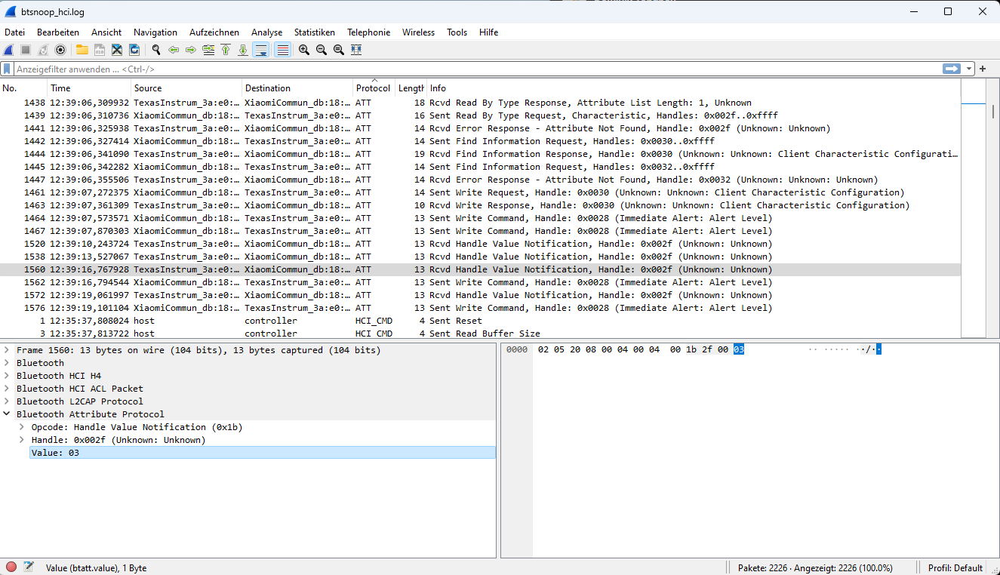
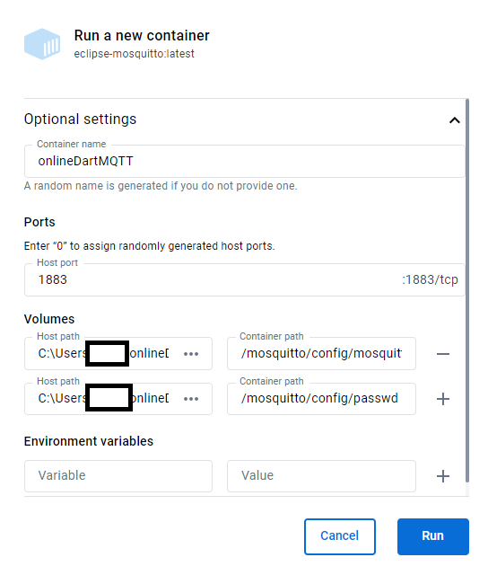

# onlineDart
Eine alte Hobby-Dart Gruppe aus den 90gern, hat sich wieder zusammengefunden. Dabei wurden die alten Smartness[^4] Dartschieben aus dem Keller geholt. Die meisten alten Scheiben sind leider nur auf bis zu 4 Spieler ausgelegt. Durch den Corona Lockdown entstand die Idee verteilt online Dart gegeneinander zu spielen.  
Mit der Zeit entstand dieses Repository. Es ist sicherlich nicht optimal programmiert, die Diagramme sind nich unbedingt UML-Konform - es handelt sich schlicht um ein Hobbyprojekt ;)  
Bei unserer Dartrunde haben wir verschiedene Regeln: Wandtreffer, Schnapszahlen, Falschwürfe (Werfen obwohl nicht am Zug) kosten Strafpunkte in Form von Moneten. Auch die Platzierung staffelt den Preis. Diese Regeln sollen möglichst variable eingestellt werden können. Aktuell ist nur 301 ohne double in/out verfügbar. Die Architektur des Dart-Servers ist auch nicht ideal dafür für weitere Spielmodi zu implementieren. Wer ein bisschen programmieren kann, kann diesen Code sicherlich für sich anpassen.  
Anfänglich wurde eine alte E-Dart-Scheibe mit einem Raspberry Pi versehen, später haben wir dann die Smartboard Dartscheibe von Smartness für uns entdeckt und bedeuted weniger Aufwand.  

## Regelüberblick
* Punkte von 301
* ohne Double In und Double out
* Bei Spielende werden Strafpunkte je nach Platzierung addiert: Platzierung=Anzahl Strafpunkte.
* Wandtreffer addieren 1 Strafpunkt
* Schnapszahlen bei Ende eines Spielzuges addieren 1 Strafpunkt. Bereits bezahlte Schnapszahlen kosten im Spiel nicht doppelt (z.B. nach Überwerfen oder 3x nicht treffen)  

## Eigenes Smartboard bauen
Durch die Client/Server Architektur und asynchroner ungekoppelter Kommunikation über MQTT soll es ermöglicht werden, sowohl mit gekauften, als auch selbstgebauten smarten Dartboads aus alten Dartscheiben, gegeneinander spielen zu können.  
Einen Ansatz, wie ihr eine alte Dartscheibe in eine Smarte mit einem Raspberry Pi umbauen könnt, findet ihr [hier](https://github.com/GittiMcHub/online-dart/tree/master/tools/buildOwnSmartboard).  
Zum testen ist dort ein offline Client in python bereitgestellt. Dies war der erste Versuch dieses Projekts und wird nicht aktiv weiterentwickelt.

# Funktionsübersicht der enthaltenen Softwarekomponenten
Kleine Übersicht der Komponenten:
## dart-board-connector
### dartBlueMqttConnector
Diese in Python geschriebene Komponente verbindet sich via Bluetooth LE mit der Dartscheibe und übersetzt die betätigten Tasten (Hex Werte) der Dartscheibe in einen String um (siehe Abschnitt: Dartboard Value Übersetzung (Interface)). Anschließend wird der String an einen MQTT-Broker published. Unter `config` müsst ihr die MAC und UUID des Dartboards angeben, sowie die Daten für den MQTT Broker. 
Außerdem müsst ihr die Dartboard ID eingeben. Diese Nummer könnt ihr frei wählen.  
Im Server müsst ihr zu jedem Spieler auch die Dartboard ID angeben. Alle Spieler und Dartscheiben können die selbe Dartboard ID nutzen (immer, wenn es nur eine Dartscheibe für das Spiel gibt). Wenn mehrere Dartscheiben für das Spiel zur Verfügung stehen, dann können unterschiedliche Dartboard IDs vergeben werden. Das hat den Vorteil, dass die Eingaben von Darscheibe 1 nicht für Spieler zählen, die der Dartscheibe 2 zugeordnet sind.   
## dart-broker 
Hier findet ihr die vorkonfigurierte mosquitto.conf und passw-Datei für das eclipse-mosquitto Docker-Image.
## dart-client
### webapp-client
Leider sind wir keine Webentwickeler und es ist sehr primitiv: Ein Webclient für den Anthrax Server. Die `index.html` einfach mit dem Browser öffnen. Der Javascript-Spagetthi Code muss noch angepasst werden:  
  
Ein MQTT Client wird im Browser gestartet und empfängt die Gamedaten vom Anthrax Server und zeigt diese an. Die Buttons werden an den Server .  
  
Die Statistik-Seite
  
## dart-server
### Anthrax
Ein in Java implementierter Server, der sich auf die Dartboards subscribed und die Gamedaten published. Die MQTT Config muss angepasst werden.
* Start Punktestand eingeben (301 oder 501... Frei wählbare Zahl) (Einzig mögliche Spielvariante)
* Double in/Double out NICHT implementiert/auswählbar
* Anzahl Spiele des Turniers
* Spielernamen und zugehörige Dartboard ID setzen
* Kosten der Strafpunkte vergeben. -> Bei Schnapszahl am Ende des Zuges (außer bei Überworfen oder Reset) kostet 1 Strafpunkt
### Onion
Hat ein anderes Konzept, befindet sich noch in der Entwicklung  


# Software Requirements
## dartBlueMQTTConnector
Python 3.9.7  
paho-mqtt 1.6.1  
bleak 0.21.1  
async-timeout 4.0.3  

## Dart-Broker
Docker  
eclipse-mosquitto-latest

## Dart-Server-Anhtrax
openJDK 17.0.8.1 2023-08-24  
Maven 3.9.6

## Dart-Client-webapp
Browser mit Javascript

# Komponentendiagramm


# MQTT User/Password
Standard Benutzername: dartboard  
Standard Passwort: smartness  
Im MQTT Docker Container ändern im CLI mit:  
```
mosquitto_passwd -c /mosquitto/config/passwd <username>
```  

Benutzername und Passwort in der `src/configfiles/mqttbroker.conf` anpassen

# MQTT Topics
| Komponente   | Aktion           | Topic              |QoS|
|--------------|------------------|--------------------|--------------------|
| Client    | Subscribe        | status/gameUpdate        |1|
| Client    | Subscribe          | status/playSound    |2|
| Client    | Publish          | dartboard/[id]    |2|
| Server       | Subscribe        | dartboard/#   |2|
| Server       | Publish          | status/gameUpdate        |1|
| Server       | Publish          | status/playSound        |2|
| dartBlueMQTTConnector       | Publish          | dartboard/[id]        |2|

# Sound MQTT Nachrichtaufbau
| Sound für   | JSON-Nachricht           | Datei|
|--------------|------------------|------------------|
| treffer    | {"sound": "TREFFER"}       |treffer.wav|
| double    | {"sound": "DOUBLE"}       | double.wav|
| triple    | {"sound": "TRIPLE"}         |triple.wav| 
| bullseye       | {"sound": "BULLSEYE"}        |bullseye.wav|
| winner       | {"sound": "WINNER"}        |winner.wav |
| strafe       | {"sound": "STRAFE"}       |strafe.wav |
| ueberworfen       | {"sound": "UEBERWORFEN"}         |ueberworfen.wav|
| reset       | {"sound": "RESET"}       |reset.wav|
| spielstart       | {"sound": "SPIELSTART"}        |spielstart.wav|
| 180       | {"sound": "MAXPOINTS"}        |180.wav|


# Klassendiagramm Anthrax-Server


# Spielablauf


# Dartboard Value Übersetzung (Interface)
Damit der Server universell in Zukunft funktioniert, interpretiert der Server die Felder nach folgendem Schema:  
Feste Länge: 3
| 1. Stelle   | 2. Stelle & 3. Stelle |
|--------------|------------------|
| Multiplikator   | Wert |  
  
Werte für weitere Würfe / Funktionen 
| Typ    | Wert |
|--------------|------------------|
|Bounce Out / Punkte Reset|996|
|Wandtreffer|997|
|Rand- / kein Treffer|998|
|Next|999|

# Smart Dartboard Übersetzungstabelle 
Wir gehen davon aus, dass alle smarten Dartboards den selben Chip verwenden. Folgend die Auflistung mit denen wir es getestet haben:  
- [x] Smartness Turbo Charger 4.0 Smart connect Dartboard[^1]  
- [x] Sunflex Smart Tec[^2]  
- [ ] Smartness Arcadia 4.0 Smart connect Dartboard[^3]  
  
Name des Bluetoothchips: `Smartness1`  
UUID: `0000ffe1-0000-1000-8000-00805f9b34fb`  

Folgend die Übersetzungstabelle für unser Dartprogramm:  
(Jedes Feld wird einzeln abgefragt. Deswegen sind für die "Feld-mal-1-Felder" 2 Hex Werte vorhanden)  
| Feld   | Dartboard Value (Hex)          | Für Server |-|Feld  | Dartboard Value (Hex)          | Für Server |-|Feld  | Dartboard Value (Hex)          | Für Server |
|--------------|------------------|--------------------|--------------------|------------------|--------------------|--------------------|--------------------|------------------|--------------------|--------------------|
|1|01 & 15 |  101||2x 1 |29   |201||3x 1 |3d    |301|
|2|02 & 16 |  102||2x 2 |2a   |202||3x 2 |3e    |302|
|3|03 & 17 |  103||2x 3 |2b   |203||3x 3 |3f    |303|
|4|04 & 18 |  104||2x 4 |2c   |204||3x 4 |40    |304|
|5|05 & 19 |  105||2x 5 |2d   |205||3x 5 |41    |305|
|6|06 & 1a |  106||2x 6 |2e   |206||3x 6 |42    |306|
|7|07 & 1b |  107||2x 7 |2f   |207||3x 7 |43    |307|
|8|08 & 1c |  108||2x 8 |30   |208||3x 8 |44    |308|
|9|09 & 1d |  109||2x 9 |31   |209||3x 9 |45    |309|
|10|0a & 1e|  110||2x10|32   |210||3x10|46    |310|
|11|0b & 1f|  111||2x11|33   |211||3x11|47    |311|
|12|0c & 20|  112||2x12|34   |212||3x12|48    |312|
|13|0d & 21|  113||2x13|35   |213||3x13|49    |313|
|14|0e & 22|  114||2x14|36   |214||3x14|4a    |314|
|15|0f & 23|  115||2x15|37   |215||3x15|4b    |315|
|16|10 & 24|  116||2x16|38   |216||3x16|4c    |316|
|17|11 & 25|  117||2x17|39   |217||3x17|4d    |317|
|18|12 & 26|  118||2x18|3a   |218||3x18|4e    |318|
|19|13 & 27|  119||2x19|3b   |219||3x19|4f    |319|
|20|14 & 28|  120||2x20|3c   |220||3x20|50    |320|
|25|51     |  125||2x25|52   |225||
|NEXT |65   |999|

# JSON Schema für den Client
Das JSON Schema zum Validieren für weitere Serverimplementierungen befindet sich unter:  `online-Dart/dart-server/schema.json`  

# Reverse Engineering eines smarten Darboards
Zuerst habe ich mir den Beitrag von Hackernoon durchgelesen [^5].  
Die Android Plattform-tools[^6], ein Android Telefon und Wireshark[^9] benötigt ihr nicht zwingend, nachdem ihr dieses Kapitel gelesen habt, aber soll hier vollsätndigkeitshalber erwähnt werden.  
Anschließend habe ich mir ein Android Telefon ausgeliehen, die Entwickleroption + HCI Bluetooth Log aktiviert und die Smartness App (IOS[^7]) (Android[^8]) aufs Handy geladen.  
Die smarte Dartscheibe eingeschaltet, die App geöffnet, mit der Dartscheibe verbunden und 3 Felder auf der Dartscheibe gedrückt.  Es ist sinnvoll den genauen Zeitstempel, wann ihr gedrückt habt, zu notieren, damit ihr hinterher im Log es einfacher habt zu suchen.  
Danach das Telefon am Rechner angeschlossen und folgenden Befehl ausgeführt:  
```
adb bugreport dart_bluetooth_report
```  
Den Bugreport kann man anschließend entpacken und unter dem Verzeichnis (zumindest in meinem Fall, wenn ihr Probleme habt schaut hier[^10]) `FS/data/misc/bluetooth/logs` mit Wireshark geöffnet.  
Im Log sind mir dann 3 Nachrichten aufgefallen, die direkt hintereinander standen und ich vermutete, dass es sich hier um meine 3 gedrückten Felder handelt:  
  

Da dort als Value "3" angegeben war und darüber die Nachrichten die Werte 51/52 bin ich davon ausgegangen, dass ich hier mein Bullseye, Bull und die 3 gefunden habe. Wie sich herausstellte waren es Hex-Zahlen. Ich wusste nun auch die MAC Adresse der Dartscheibe und dass diese eine "Handle Value Notification" sendet.  
Anfänglich konnte ich mich mit der Bleak Bibliothek mit der Dartscheibe verbinden, allerdings habe ich keine Werte empfangen. Dies lag daran, dass ich mich nicht auf einer UUID vom Bluetooth Gerät subscribed habe.  
Alternativ könnt ihr auch 
```
python src/bluetoothExplorer/findDevices.py
```
ausführen und die MAC Herausfinden:  
  

Dank ChatGPT[^11] habe ich dann ein Skript genommen, was mir die UUIDs aus dem Bluettoth Gerät ausgibt.  
```
python src/bluetoothExplorer/findCharacteristics.py
```  
  

ChatGPT hat mir dann auch vorgeschlagen, welche UUID ich benutzen soll (Woher ChatGPT das weiß, weiß ich nicht, ich habe auch keine anderen UUIDs ausprobiert. Hauptsache es funktioniert :), denn tiefer habe ich mich mit dem Bluetooth Protokoll nicht beschäftigt.)  
Wenn ihr nun die MAC und die UUID habt, habe ich mich mit folgendem Skript verbunden und konnte anschließend jedes Feld der Dartscheibe drücken und die Tabelle unter "Smartness Dartboard Übersetzungstabelle" erstellen.   
Spaßeshalber habe ich es "dartbleed" genannt. Die MAC und UUID müsst ihr an eure Dartscheibe anpassen:  
```
python /src/bluetoothExplorer/dartbleed.py
```  
  

Dadurch habe ich auch herausgefunden, dass jedes Feld einzeln abgefragt wird. Bei alten Dartscheiben sind manchmal die 1x Felder zusammengefasst (siehe [hier](https://github.com/GittiMcHub/online-dart/tree/master/tools/buildOwnSmartboard)). Für weitere Informationen zum Thema Bluetooth sind unten zu finden[^15].

# Installation und How To Use (TODO)
## Dart-Broker
Entweder habt ihr schon einen MQTT Broker am laufen oder ihr benötigt dafür Docker[^12]   
Das Image `eclipse-mosquitto:latest` herunterladen  
Container Optional settings anpassen und starten:  
`Ports: 1183 und 8083`  
`(Pfad zum Ordner)/online-Dart/dart-broker/mosquitto.conf:/mosquitto/config/mosquitto.conf`  
`(Pfad zum Ordner)/online-Dart/dart-broker/passwd:/mosquitto/config/passwd`  
  

Alternativ über die Kommandozeile mit  
```
docker run -p 8083:8083 -p 1883:1883 -v C:/(Pfad zum Ordner)/onlineDart/dart-broker/mosquitto.conf:/mosquitto/config/mosquitto.conf -v C:/(Pfad zum Ordner)/onlineDart/dart-broker/passwd:/mosquitto/config/passwd --name dartMQTTbroker eclipse-mosquitto:latest
```
Zum testen könnt ihr einen MQTT Client ausführen und Nachrichten an den Broker schicken[^14].

## Dart-Client
### Dart-Client-Webapp
`index.html` mit einem Editor öffnen und die MQTT Broker Daten und die ID eintragen  
`index.html` mit einem Browser öffnen

## Dart-Server
Es gibt unterschiedliche Serverimplementierungen, aus denen ihr auswählen könnt. Derzeit existieren nur Server in JAVA.  
Dafür benötigt ihr openjdk[^16] (getestet mit Version 17.0.8.1 2023-08-24) und maven[^13]     
### Anthrax
Im anthrax-server eure mqttbroker.conf Datei anpassen  
`mqtt_broker_ip:IP.ADRESSE.BROKER.EINTRAGEN`  
`mqtt_broker_port:1883`  
`mqtt_username:dartboard`  
`mqtt_password:smartness`  

Mit dem Befehl im Projektordner 
```
mvn clean package
```
den Server kompilieren.  
  
#### Option A mit JVM starten
Anschließend mit folgendem Befehl den Server starten  
```
java -jar .\target\anthrax-1.0-SNAPSHOT-jar-with-dependencies.jar
```  

#### Option B mit Docker starten
in das Verzeichnis `/online-Dart/dart-server/anthrax-server` wechseln und das Terminal öffnen, um das Image zu bauen.  
```
docker build -t anthrax-server-container .
```
Anschließend ausführen:
```
docker run -i -p 1884:1883 --name anthrax-server anthrax-server-container
```
Da der Hostport 1883 vom MQTT Broker belegt ist, wählen wir hier den 1884.   
Zukünftig lässt sich der Server mit folgendem Befehl starten.
```
docker start -i anthrax-server
```
 Das -i ist wichtig, damit die Spielparameter eingestellt werden können.  
Ps.: Das Server Image lässt sich folgend exportieren.
```
docker save -o anthrax_server_image.tar anthrax-server-container
```
Und mit diesem Befehl importieren: 
```
docker load -i mein_server_image.tar
```

#### Parameter setzen
Und die Einstellungen in der Kommandozeile des Turniers setzen:  
`Anzahl Spiele Turnier`  
`Anzahl Spieler`  
`Name Spieler`  
`Dartboard ID des Spielers`  
`Kosten für einen Strafpunkt in Cent`  
  

Der Server ist gestartet und das Spiel beginnt mit dem ersten Spieler.  

### Onion
TODO  
 

## Dart-Board-Connector
### DartblueMQTTConnector
Ihr benötigt für den Dart-Board-Connector ein Bluetooth fähiges Gerät und Python in der Version `3.9.7`[^17]  
Zusätzlich müsst ihr die erforderlichen Bibliotheken über PIP installieren  
Dafür führt ihr folgenden Befehl im Verzeichnis `online-Dart\dart-board-connector\dartBlueMqttConnector` aus:  
```
pip install -r requirements.txt
```  

Im DartBlueMqttConnector die Configfiles anpassen. Welche genauen Werte ihr für euch dort eintragen müsst, findet ihr im Abschnitt "Reverse Engineering eines smarten Darboards"   
-Mac-Adresse  
-Notification-UUID von der Dartscheibe  
-Dartboard ID  
-MQTT Broker Zugangsdaten.  

Dartscheibe einschalten.  
Mit folgendem Befehl den Connector starten:  
```
python dartBlueMqttConnector.py
```

## Troubleshooting
Wenn ihr Online gegeneinander spielt, achtet darauf, dass ihr euren Router und eure Firewall entsprechend konfiguriert. Auch wenn ihr den MQTT Broker auf einem anderen PC im LAN laufen lasst, kann es u.U. nötig sein die Firewall Einstellungen anzupassen.

# Copyrights und Links
Strafe sound:  https://pixabay.com "Cash Register" from MAXOU-YT  
180 sound:  https://www.myinstants.com/de/instant/180-russ-bray-48439/  
Alle anderen Sounds sind original Sounds von einem alten Smartness Dartboard, die mit einem Iphone aufgezeichnet wurden.  
Animationen Web Client:  
https://www.youtube.com/watch?v=emWCSpEDx8Y  
https://www.youtube.com/watch?v=7HrmD_vIMIk  
https://ezgif.com/video-to-gif  
https://giphy.com/gifs/VNOMtechniekenbouw-darts-raak-vnom-cNezWvIqgCYCevvLHi  
https://giphy.com/gifs/bbcamerica-funny-reaction-1lBIIjVOnY5YfdOnQe  
https://giphy.com/gifs/funny-baby-winner-LFiOdYoOlEKac

[^4]: Die Marke Smartness gehört der New Games & Sports (NG & S) GmbH
[^1]: Smartness Turbo Charger 4.0  
https://shop.carromco.com/shop/dartboards/smart-connect-dartboard-turbo-charger-4-0/
[^2]: Sunflex Smart Tec Dartscheibe:  
https://www.amazon.de/Sunflex-Dartscheibe-Smart-elektronische-Ersatzspitzen/dp/B07X1TMMX4
[^3]: Smartness Arcadia 4.0  
https://shop.carromco.com/shop/dartboards/smart-connect-dartboard-arcadia-4-0/  
[^8]: Original Smartness App Android:  
https://play.google.com/store/apps/details?id=com.evisionhk.smartness&hl=de&gl=US  
[^7]: Original Smartness App IOS:  
https://apps.apple.com/de/app/smartness-electronic-dartboard/id1239487436  
[^14]: MQTT Explorer zum Testen:  
http://mqtt-explorer.com/
[^13]: Maven Installieren:  
https://maven.apache.org/install.html  
[^12]: Docker installieren:  
https://docs.docker.com/engine/install/  
[^11]: Bei Fragen:  
https://chat.openai.com  
[^9]: Wireshark:  
https://www.wireshark.org/download.html  
[^5]: Bluetooth Geräte Reverse Engineering:  
https://hackernoon.com/de/Reverse-Engineering-von-LED-Leuchten-mit-Python%2C-um-Ihren-Computermonitor-in-einen-Umgebungsmonitor-umzuwandeln  
[^10]: Android HCI Snoop Log (Bei Problemen):  
https://stackoverflow.com/questions/28445552/bluetooth-hci-snoop-log-not-generated  
[^6]: Android Plattform Tools:  
https://developer.android.com/tools/releases/platform-tools  
[^15]: Thema Bluetooth Informationen:  
http://docwiki.embarcadero.com/RADStudio/Sydney/de/Verwenden_von_Bluetooth_Low_Energy
https://www.golem.de/news/golem-de-programmiert-bluetoothle-im-eigenbau-1404-105896.html  
[^16]: OpenJDK:  
https://openjdk.org/install/  
[^17]: Python:  
https://www.python.org/downloads/  