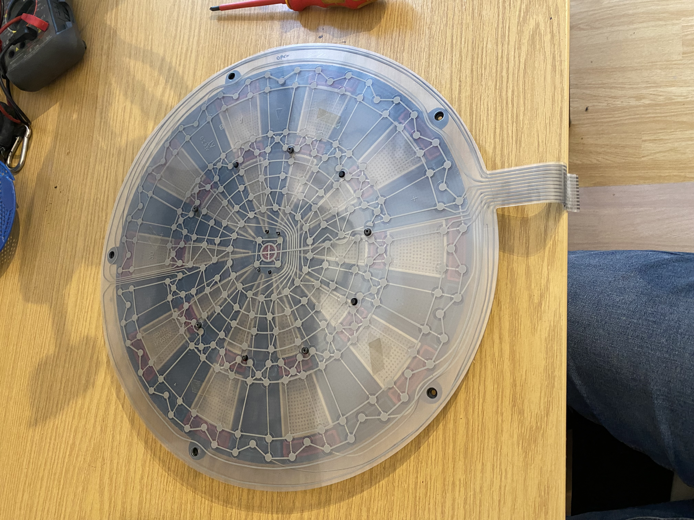
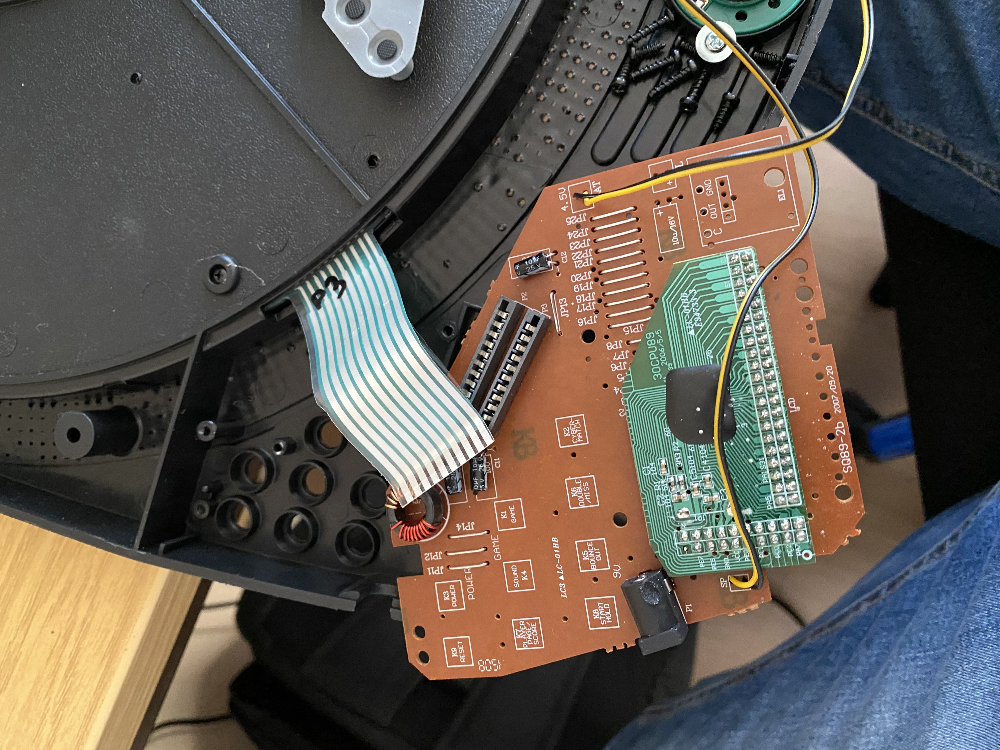
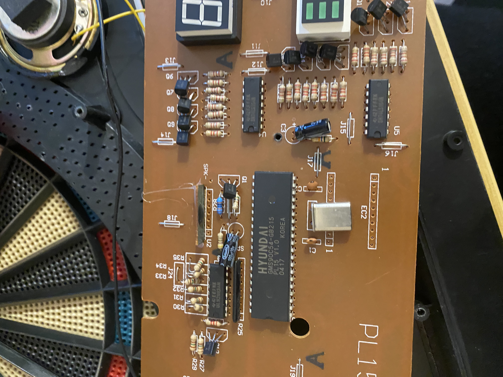
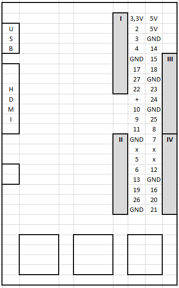
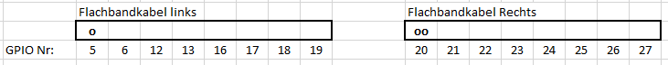
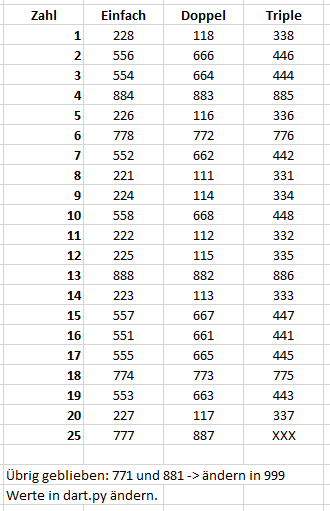
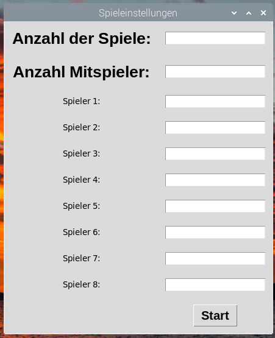
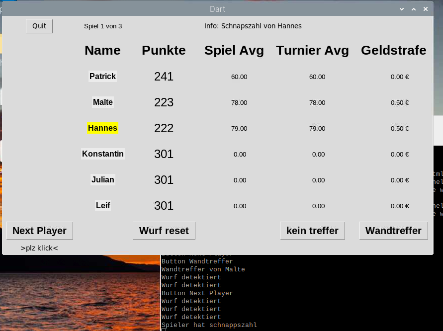

# pythonDart
Wird nicht aktiv weiterentwickelt!

Simples Data Tournament Game.  

Regeln:
Startpunkte 301
Schnapszahl am Ende der Runde + 0,50 €
Wandtreffer +0,50 €
1. Platz = +0,50 € 
2. Platz = +1,00 €
...
6. Platz = +3,00 €
...  
Ohne double out

# Schaltung herausfinden
Die Dartscheibe hat  
20*2 1x-felder  
20 double-Felder  
20 triple-Felder  
Bull und Bullseye. Macht 82 Felder.  
Manche Dartscheiben fragen alle 82 Felder einzeln ab, manche zählen die beiden 1x Felder einer Zahl zusammen. Dann sind es nur 62 Möglichkeiten.  

Am besten Dartschreibe aufschrauben und nachsehen!
So Sieht die Sensormatte aus:

Wie diese verschaltet ist, lässt sich manchmal nur raten. Vorallem wenn der Microcontroller vergossen ist wie hier:

Da lässt sich entweder die Sensormatte nachverfolgen (sehr unübersichtlich), oder schauen, wie viele Leiterbahnen von der Sensormatte kommen.

Einfacher ist es hier:

Hier lässt sich anhand des Datenblatts und der Nachverfolgung der Leiterbahnen herausfinden, welche Leiterbahnen für Aus- und Eingänge sind.

# Pin Belegung
Pinbelegung Beispiel:  
  

# Werte herausfinden

In gpio_auslesen.py die in- und output GPIOs setzen  

dartPinArray_outputs = [5,6,12,13,16,17,18,19]  
dartPinArray_inputs = [20,21,22,23,24,25,26,27]  

werteMatrix = [  
[111,112,113,114,115,116,117,118],  
[221,222,223,224,225,226,227,228],  
[331,332,333,334,335,336,337,338],  
[441,442,443,444,445,446,447,448],  
[551,552,553,554,555,556,557,558],  
[661,662,663,664,665,666,667,668],  
[771,772,773,774,775,776,777,778],  
[881,882,883,884,885,886,887,888]  
]

Anschließend Skript ausführen und einzeln die Felder drücken und in eine Tabelle schreiben:  

Das Array sieht dann so aus:  
self.werteMatrix = [  
[208,211,214,209,212,205,220,201],  
[108,111,114,109,112,105,120,101],  
[308,311,314,309,312,305,320,301],  
[316,307,319,303,317,302,315,310],  
[116,107,119,103,171,102,115,110],  
[216,207,219,203,217,202,215,210],  
[999,206,218,118,318,306,125,106],  
[999,213,204,104,304,313,225,113]  
]

# Spiel starten

# Copyrights
Strafe sound: https://pixabay.com "Cash Register" from MAXOU-YT
All Other: Originalsound from Smartness Dartboard recorded with an Iphone

